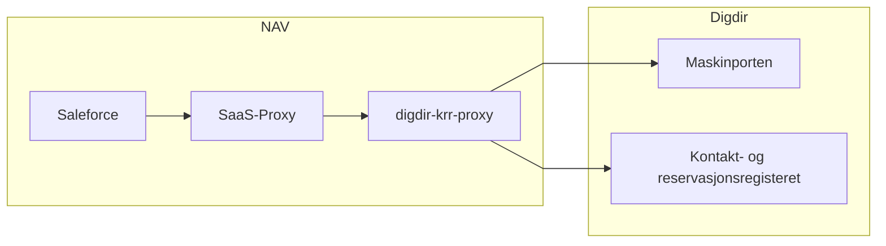
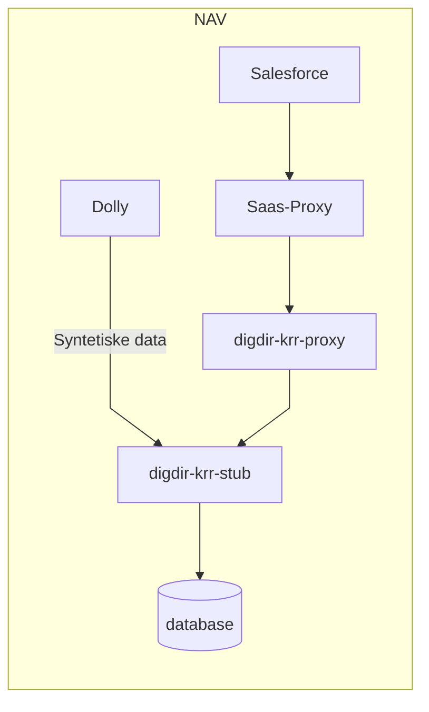

# Digdir - Kontakt- og reservasjonsregisteret (KRR)

Denne pakken inneholder en service klasse for å hente ut data fra KRR.

Salesforce integrerer mot Nav's interne [digdir-krr](https://github.com/navikt/digdir-krr) som eies av Team Rocket.

Årsaken til at vi går via proxyen fremfor direkte på KRR via Maskinporten er den ekstra støtten som er bygget inn i krr proxyen. Dette inkluderer audit logging, tilgangskontroll og identstøtte via PDL. Krr proxyen har også støtte for Dolly i Dev.

## Oversikt integrasjon

### Oversikt (prod)

### Oversikt (dev)

