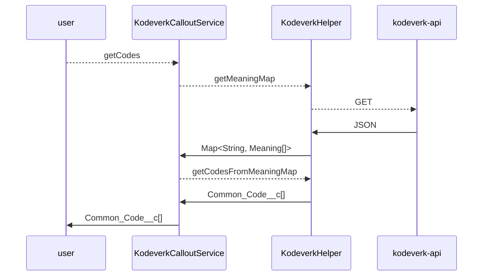
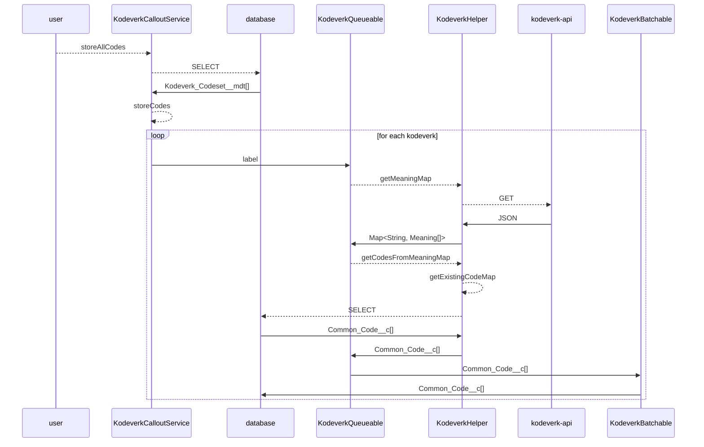

# Felles kodeverk

`KodeverkCalloutService` contains methods for fetching codes from Felles
kodeverk for ad hoc use or for storing them as `Common_Code__c` records.

## Installation

Set up a Named Credential to `https://kodeverk-api.nav.no/` named `kodeverk`
with an appropriate External Credential, Named Principal, and permissions.

## Usage

Use `getCodes(String)` to get the codes for a given kodeverk for immediate use.

Use one of `storeCodes(Set<String>)` and `storeAllCodes()` to fetch codes and
store them.

## Workings

In order to not choke when updating a large number of codes, the callout and
logic for each code set is queued separately, and if necessary split into
multible batches for upsert. Which classes handle this is illustrated in the
bottom diagram below.

### Ad hoc usage

### Store all codes

